# WebCenter Content on OpenShift

## Overview

This repository contains a [Dockerfile](wcc/Dockerfile) for building [Oracle WebCenter Content](https://www.oracle.com/technetwork/middleware/webcenter/content/overview/index.html) 12.2.1.4 on [Oracle WebLogic Server](https://www.oracle.com/middleware/technologies/weblogic.html) 12.2.1.4 using [Oracle Database](https://www.oracle.com/database/technologies/) Enterprise Edition 12.2.0.1.

## Requirements

### Accounts

- [Oracle account](https://profile.oracle.com/myprofile/account/create-account.jspx) (to use pre-built images with binaries)
- You will need [sudo / superuser rights](https://en.wikipedia.org/wiki/Sudo) on your machine in order to install Docker and Docker Compose

### Disk Space

- [WebCenter Content zip binary](#download-webCenter-content-zip-binary) = 1.6 GiB
- image `middleware/fmw-infrastructure:12.2.1.4-200316` = 2.3 GiB
- image `database/enterprise:12.2.0.1` = 3.4 GiB
- image `oracle/wccontent:12.2.1.4` = 5.6 GiB

### Software

#### The OpenShift Server

- [OpenShift 3.11](https://docs.openshift.com/container-platform/3.11/welcome/index.html)

#### Your Local Machine

- [Docker 18.09.0 or greater](https://docs.docker.com/install/#supported-platforms)
  - Version 18.09.0 or greater is required to use the `chown` [flag when copying files](https://github.com/moby/moby/pull/35521)
  - Docker is used to build the WebCenter Content image since, unlike Oracle Database and Oracle FMW Infrastructure, Oracle does not provide a pre-built WebCenter Content image.
  - Ensure the Docker Daemon is running: `sudo service docker start`
 on
- [OpenShift CLI](https://docs.okd.io/3.11/cli_reference/get_started_cli.html)

### OpenShift Access

1. Validate you can login to the [OpenShift Web Console](https://docs.openshift.com/container-platform/3.11/getting_started/developers_console.html)

2. Validate you can login using the OpenShift CLI:

    `oc login https://myserver:8443 --token=Wbx2yk9a16s6FizAh_XcZwfptgJUtIQX9VGTLZ-Xji1`.

    Your token can be found from the OpenShift Web Console by clicking on your profile name (in the top right), then "Copy Login Command":
    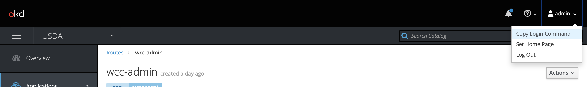

3. Create a new OpenShift project:

    `oc new-project oracle-apps`

    In this case my project is named `oracle-apps`. You can name your project differently but if you do, you will need to ensure any files or commands which reference `oracle-apps` are updated to use your project name (such as the next step)

4. Have your OpenShift admin run the following commands (as the OpenShift `system:admin` user) to created a service account (named `oracle`), and add the anyuid policy to this user:

    1. `oc create sa oracle`
    2. `curl -o anyuid-role.yaml https://raw.githubusercontent.com/jhult/wcc-on-openshift/master/openshift/anyuid-role.yaml`
    3. `oc apply -f anyuid-role -n oracle-apps`
    4. `oc adm policy add-scc-to-user anyuid -z oracle -n oracle-apps`

## Build and Deploy

### Login to the Oracle Container Registry

1. Navigate to the [Oracle Container Registry](https://container-registry.oracle.com)
2. Sign In using your Oracle account
3. Navigate to [*Middleware*](https://container-registry.oracle.com/pls/apex/f?p=113:1:13639930739021::NO:1:P1_BUSINESS_AREA:2) > *fmw-infrastructure*
4. Click Continue to agree and accept the Oracle terms and restrictions
5. Navigate to [*Database*](https://container-registry.oracle.com/pls/apex/f?p=113:1:12598430189688::NO:1:P1_BUSINESS_AREA:3) > *enterprise*
6. Click Continue to agree and accept the Oracle terms and restrictions
7. Run this command in a terminal and enter your your Oracle account credentials: `sudo docker login container-registry.oracle.com`

### Build Oracle Database Image

Oracle provides a pre-built image which can be imported directly into OpenShift from the Oracle Container Registry (container-registry.oracle.com/database/enterprise:12.2.0.1).

1. Create a new OpenShift secret which will log us into the Oracle Container Registry:

    `oc create secret docker-registry oracle-container-registry-secret --docker-server=container-registry.oracle.com --docker-username=YourOracleAccountEmailGoesHere --docker-password=YourOracleAccountPasswordGoesHere --docker-email=YourOracleAccountEmailGoesHere`

    In the above command, be sure to replace `YourOracleAccountEmailGoesHere` with your Oracle account email and `YourOracleAccountPasswordGoesHere` with your Oracle account password.

2. Import the Oracle Database Image

    `oc import-image oracle12c:12.2.0.1 -confirm reference-policy='local' -from=container-registry.oracle.com/database/enterprise:12.2.0.1`

3. Tag the Oracle Database Image

    `oc tag oracle12c:12.2.0.1 oracle12c:latest`

    If successful, you will see output similar to this:

### Deploy Oracle Database and Validate

1. Run the following to deploy Oracle Database:

    `oc process -f db/db-deployment.yaml | oc create -f -`

    If you changed your OpenShift project name from `oracle-apps`, then you will need to edit the `db-deployment.yaml` file and alter `namespace` to be your project name.

2. After about 3-15 minutes, the Database service should be up and running.  You can track the progress of the deployment by doing the following:

    1. Get the pod name: `oc get pods`
        The pod name should be similar to `oracle12c-1-bltft`

    2. Check the logs either via the pod *Logs* tab in the Web Console or by running this command:

        `oc logs oracle12c-1-bltft -c oracle12c`
            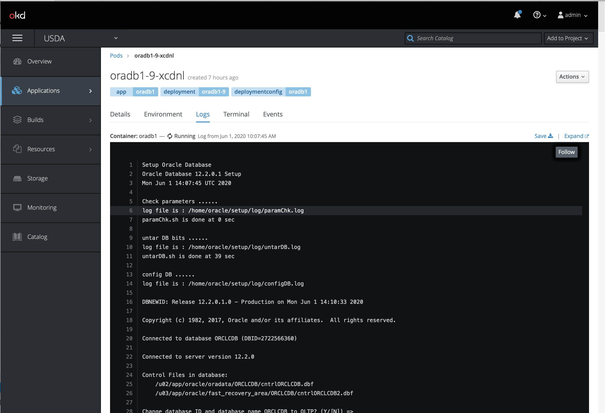

3. Validate that you can login to the Oracle Database view `sqlplus`. Go to the pod, then the Terminal tab and run the following 2 commands:

    1. `source /home/oracle/.bashrc`
    2. `sqlplus sys/Oradoc_db1@ORCLCDB as sysdba`

### Build the WebCenter Content Image

#### Download the Required Files

1. Navigate to a temporary directory (e.g. `/tmp`) where you have full permissions. Ensure you can access the Internet and have at least 10 GiB of free disk space.

2. Download [this zip file](https://codeload.github.com/jhult/wcc-on-openshift/zip/master)

    `curl -o wcc-on-openshift.zip https://codeload.github.com/jhult/wcc-on-openshift/zip/master`

3. Extract the zip file

    `unzip wcc-on-openshift.zip`

#### Download the WebCenter Content Installation Zip File

1. Download the WebCenter Content installation zip file from [here](https://www.oracle.com/middleware/technologies/webCenter-content-download.html).

    Note: This zip file might be downloaded with one of these file names:
    - `V983399-01.zip`
    - `fmw_12.2.1.4.0_wccontent_Disk1_1of1.zip`

2. Move the downloaded zip file under the `wcc` directory in the directory where you extracted `wcc-on-openshift.zip` (e.g. `/tmp/wcc-on-openshift-master/wcc`). The zip file needs to be named `fmw_12.2.1.4.0_wccontent_Disk1_1of1.zip` (rename the downloaded zip file if need be).

#### Build the Image

1. Navigate to the `wcc` directory in the directory where you extracted `wcc-on-openshift.zip` (e.g. `/tmp/wcc-on-openshift-master/wcc`).

2. Run this command:

    `docker build .`

3. You should eventually(~ 15-20 minutes later) see a message indicating success:

    `Successfully built 1c527f5befa9`

#### Push the Image to OpenShift

1. Run the following command to push the image we just built:

    `oc new-app wccontent --docker-image wccontent`

2. Once this is done successfully, you should be able to see the ImageStream by running this command:

    `oc get is`

    ```
    NAME                 DOCKER REPO                               TAGS                                                   UPDATED
    docker               172.30.1.1:5000/oracle-apps/docker               latest                                                 3 days ago
    enterprise           172.30.1.1:5000/oracle-apps/enterprise           12.2.0.1                                               9 days ago
    fmw-infrastructure   172.30.1.1:5000/oracle-apps/fmw-infrastructure   12.2.1.3-200316,12.2.1.4-200316,12.2.1.3 + 1 more...   3 days ago
    instantclient        172.30.1.1:5000/oracle-apps/instantclient        latest                                                 9 days ago
    oraclelinux          172.30.1.1:5000/oracle-apps/oraclelinux          7                                                      9 days ago
    oradb                172.30.1.1:5000/oracle-apps/oradb                12.2.0.1-ee
    wccontent            172.30.1.1:5000/oracle-apps/wccontent            12.2.1.3                                               24 hours ago
    ```

### Deploy WebCenter Content

1. Create the Deployment in the OpenShift Web Console

    Now, it's time to deploy WebCenter Content. Click *Deploy Image* as shown below and select the *wccontent* image stream uploaded above.

    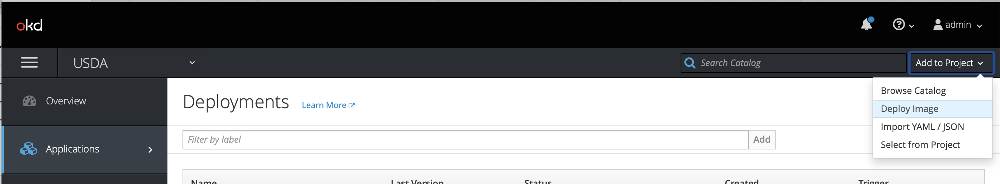

2. Create the Persistent Storage and attach it to the Deployment

    Add Persistent Storage for the WebLogic Server domain configuration data and log files.
    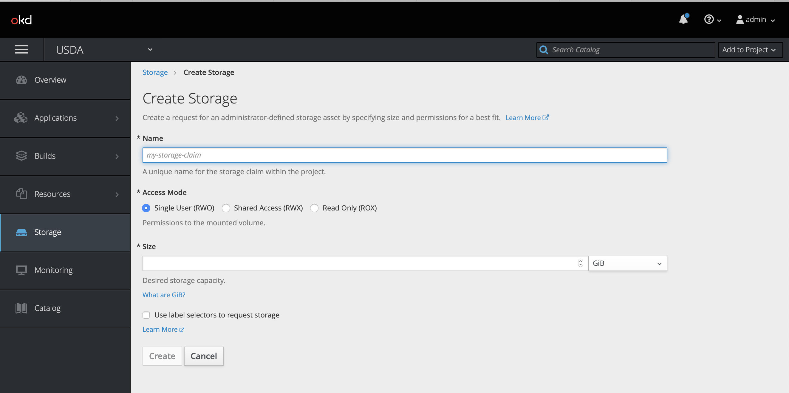

    Then, attach it in the deployment configuration as shown below:
    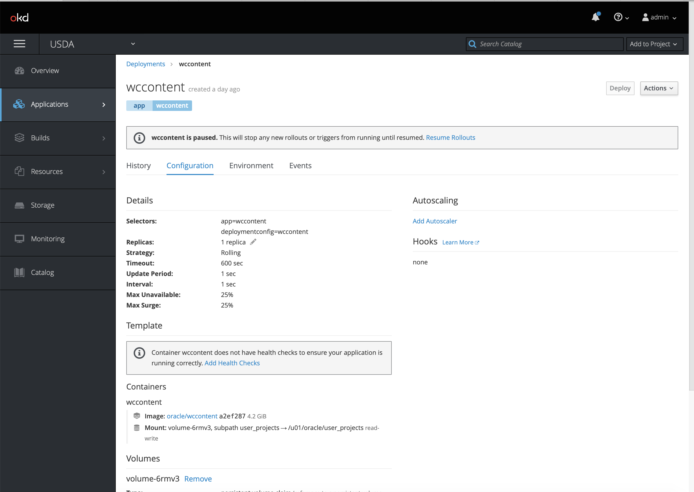

3. Create the Required Environment Variables

    Based on the [wcc.env](wcc/wcc.env) file create the environment for WebCenter Content
    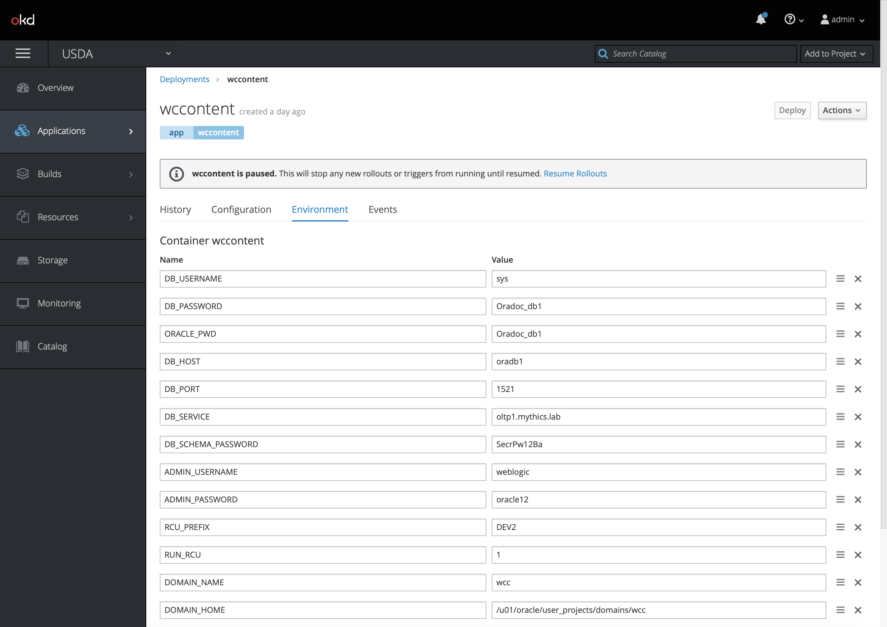

4. Deploy `wccontent` and watch the logs for the pods to finish (takes anywhere from 15-20 minutes).
    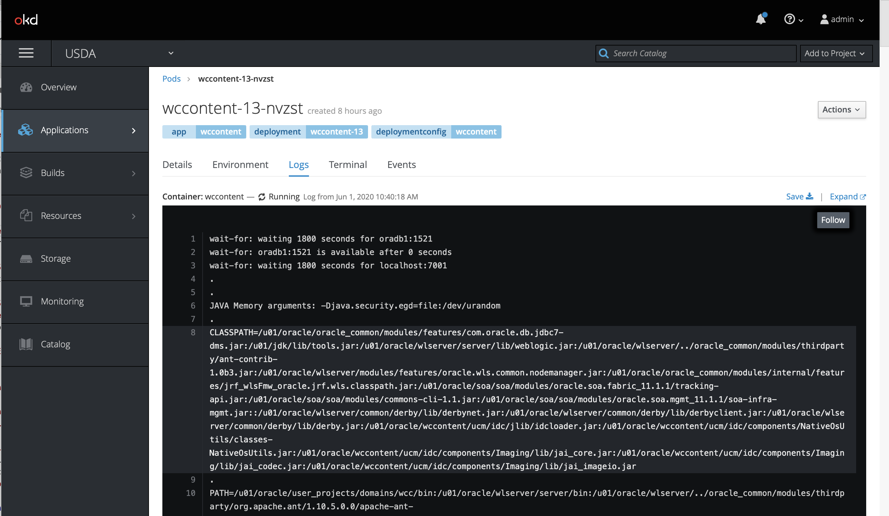

5. Verify the Pod is running:
    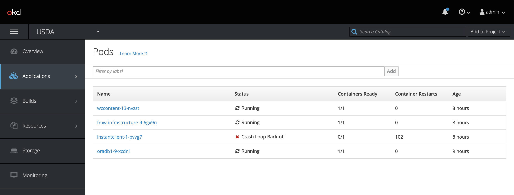

### Create the Service

1. Run the following:

    `oc apply -f wcc/wcc-service.yaml`

### Create Routes

Create two routes:

1. WebLogic Server Admin Console (port 7001):
    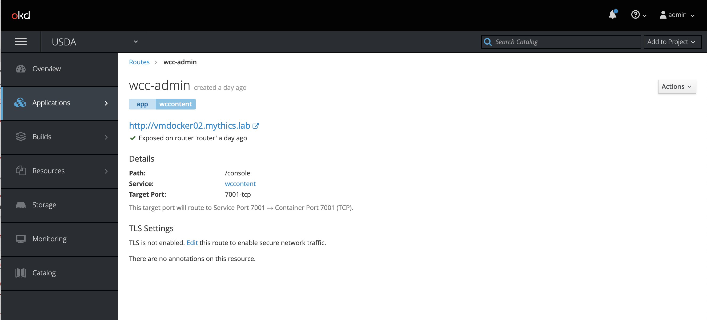

2. WebCenter Content (port 16200):
    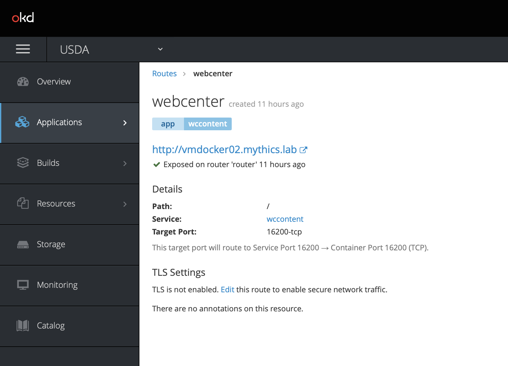

## Accessing the Application

### URLs

- WebLogic Server Administration Console: <http://server:7001/console/>
- WebCenter Content: <http://server:16200/cs/>

Credentials can be found in the [wcc.env](wcc/wcc.env) file.

### First Login

1. The first time you access the WebLogic Server Administration Console (after a WebLogic Server restart), it will deploy the Console and redirect you to the login page.
    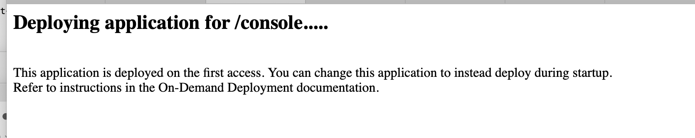
    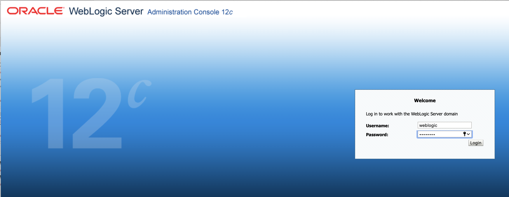
    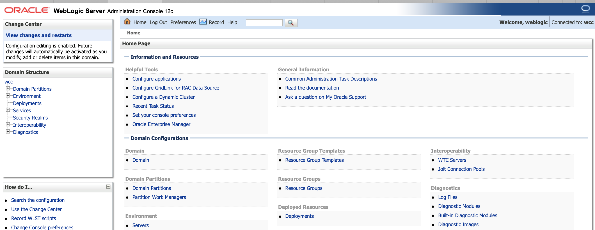

2. The very first time you access WebCenter Content, it will ask you to select configuration options and restart the node.
    

## WebCenter Content Restart

To restart WebCenter Content, you can remove the pod and it will restart as the auto start/rollout is enabled in the deployment.

This can be done either via one of these two methods:

1. OpenShift Web Console:
    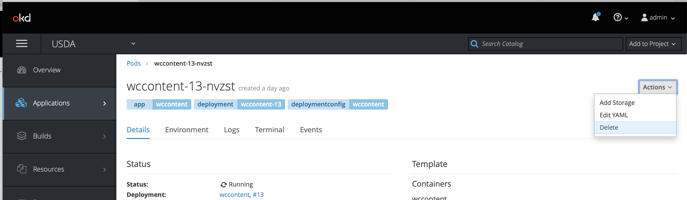

2. The `oc` CLI:
    1. Get the name of the pod by running this command:

        `oc get pods`

        ```
        NAME                         READY     STATUS             RESTARTS   AGE
        fmw-infrastructure-9-6gx9n   1/1       Running            0          24m
        instantclient-1-pvvg7        0/1       CrashLoopBackOff   9          24m
        oradb1-9-xcdnl               1/1       Running            0          35m
        wccontent-13-6wtp6           1/1       Running            1          26m
        ```

    2. Delete the pod by running this command:

        `oc delete pod wccontent-13-6wtp6`

    3. Once the pod has started again, you can login as normal to WebCenter Content see the login screen as shown below:
    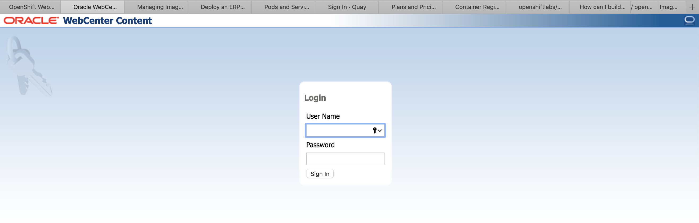
    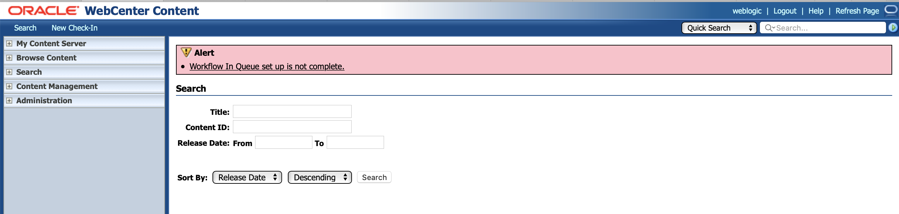